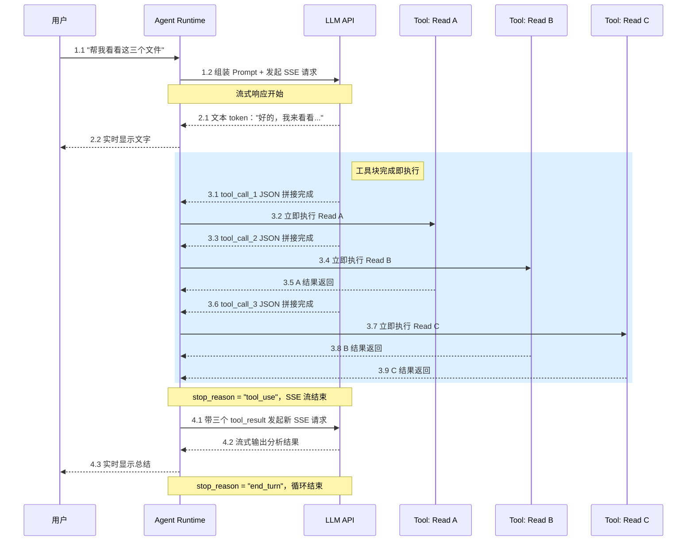
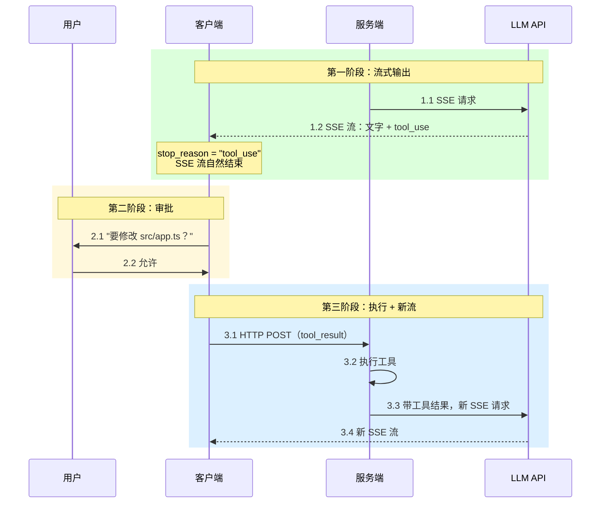
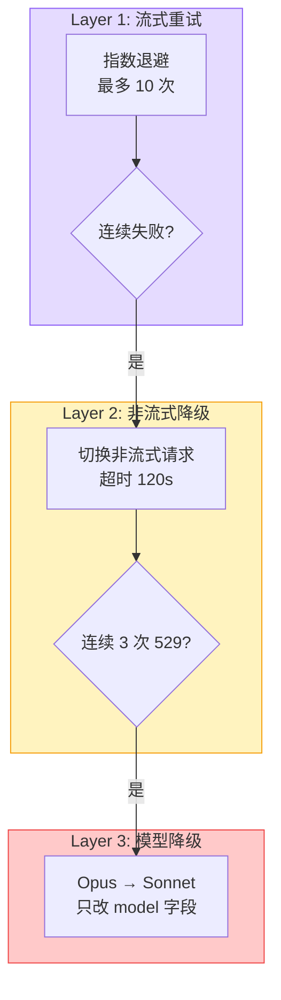
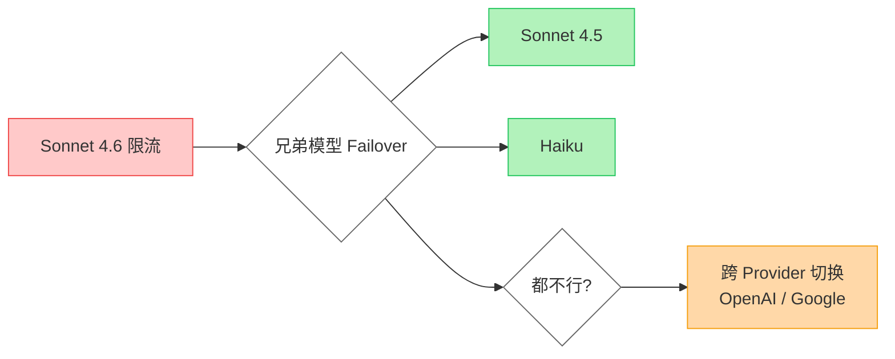
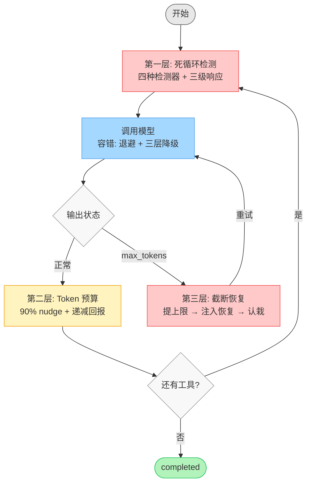

# Agent Loop 深度分享：流式响应、容错机制与运行时安全

---

## 引子

在几年前经典的 `ReAct` 模式下，假如让 Agent 把项目里 12 个 ESLint 报错全部修掉，过程是这样：

```
Thought: 先看有哪些 ESLint 错误
Action:  Bash("npx eslint src/ --format json")
Observation: 12 个文件有错误                     ← 必须等结果回来

Thought: 看第一个文件的错误
Action:  Read("src/utils.ts")
Observation: Line 3: 'value' is defined but...   ← 必须等结果回来

Thought: 修掉这个未使用变量
Action:  Edit("src/utils.ts", ...)
Observation: 完成                                ← 必须等结果回来
...重复 11 次
```

每一步都在等——等模型想完、等工具返回。串行跑下来，光等待就要20 秒。这就是 `ReAct` 的"思考→行动→观察"三段循环，逻辑虽然清晰，但整个流程是串行执行的。

如今用 Claude Code 来做，整个过程非常丝滑：文字流式输出，紧接着就是工具调用，读、改文件、然后读下一个文件，几乎感觉不到等待。LLM 还在生成第二个工具调用的参数时，第一个工具可能就已经执行完返回了。

这不是模型变快了，是"边生成边执行"的调度在起作用。流式架构在串行链条的每一段里都插入了并行，把等待时间压到最小。

这段体验的差距，不是模型能力的差距——正是 Agent Loop 架构的差距。以前的`ReAct` 是"想一步、做一步、等一步"；而如今的 Agent Loop 是"边想边做、该等的等、不该等的不等"。差距怎么产生的？靠的是三个核心机制：

Agent Loop 三大核心机制

1. **流式响应**——怎么让模型和工具"边说边干"？
2. **容错机制**——`LLM API` 挂了怎么办？
3. **运行时安全**——Agent 自己失控了怎么办？

Agent Loop 不只是"循环调模型"——它要管模型和工具怎么协作、`API` 挂了怎么活下来、Agent 自己跑飞了怎么拉回来。这就是我这篇文章要讲述的事情。

---

## 一、流式响应

"边想边做"听起来简单，但具体怎么实现？我们从最底层的传输协议开始，一层层往上搭。

### 为什么是 `SSE`，不是 `WebSocket`？

> SSE：Server-Sent Events（服务端推送事件）。

所有主流 LLM `API` 都用 `SSE` 做流式响应，原因很直接：LLM 流式输出就是服务器往客户端推 `token`，客户端只需要听。**单向推送，**`SSE` **天然适合。** 而`WebSocket` 是双向管道，对 LLM 场景来说属于杀鸡用牛刀。

而且 `SSE` 有几个实在的好处：

- 跑在标准 `HTTP` 上不需要协议升级，复用现有的网关。
- 自带 `Last-Event-ID` 重连机制，每次请求都可以验证身份。
- 还有一个常被忽视的安全优势：`WebSocket` 的认证只发生在握手阶段，一旦 `HTTP Upgrade` 完成，后续数据帧的收发不再经过 `HTTP` 认证层。权限失效（比如过期）后 `WebSocket` 连接照样存活、数据照样流通。`SSE` 没这个问题，每次请求都是独立的 `HTTP` 请求，`Authorization Header` 每次都校验，认证粒度是"每次请求"而不是"每次连接"。

`SSE` 返回的数据格式也简单：`event:` 标类型，`data:` 放 `JSON`，空行结束。以 Anthropic 的 `API` 为例，一次完整的流式响应，事件流长这样：

```
1. message_start        → 一条新消息开始了
2. content_block_start  → 一个内容块开始了（文本块 or 工具调用块）
3. content_block_delta  → token 一个个推过来："你" "好" "，" "我" "来" "..."
4. content_block_delta  → 继续推...
5. content_block_stop   → 这个内容块结束了
6. message_delta        → 元信息（为什么停了、用了多少 token）
7. message_stop         → 整条消息结束了
```

如果模型只是回复一段文字，把 delta 里的文本拼起来渲染就完事了，但 Agent 不只是吐文字，Agent 要调工具。工具调用的参数是结构化的 `JSON`，而 `SSE` 推过来的是一个个 `token` 碎片。文本碎片拼错了顶多显示乱码，`JSON` 碎片拼错了直接解析失败——工具根本没法执行。所以，流式架构要落地到 Agent 上，第一个要解决的问题就是：**怎么从 `token` 碎片里拼出完整的工具调用？**

### Tool Call 的流式解析：拼碎片

模型决定调用工具时，会输出一个 `tool_use` 类型的内容块。但模型是自回归生成的，一个 `token` 一个 `token` 蹦，所以你收到的不是完整 `JSON`，而是一堆碎片：

```
content_block_start → {"type": "tool_use", "name": "read_file", "input": {}}

content_block_delta → partial_json: '{"file*'
content_block_delta → partial_json: 'path": "'
content_block_delta → partial_json: 'src/uti'
content_block_delta → partial_json: 'ls.ts"}'

content_block_stop  → （结束）
```

`content_block_start` 时 `input` 是空对象，真正的参数通过后续 delta 一片一片推过来，等 `content_block_stop` 后把碎片拼成完整的 `{"file_path": "src/utils.ts"}`，才能 `JSON.parse()`。

**所以，过早解析 = 崩溃。**

好，碎片拼接的问题解决了——我们能从流里准确识别出完整的工具调用。但解析只是第一步。解析完了，下一个问题马上来了：**什么时候执行这个工具？**

### "边说边执行"

最简单的做法：等整条消息说完再依次执行工具。早期 Agent 大多这么干，逻辑简单不易出错。但这么做等于把流式的优势全丢了——模型还在生成后面的内容，前面已经解析好的工具调用却干等着。现在主流的 Agent 都在做一个关键优化：**工具块一完成就立刻开始执行，不等整条消息说完。**

假设用户让 Agent 查看三个文件，完整的处理流程如下：




工具执行和后续调用的生成在时间上**重叠**。读 5 个文件的任务，感知延迟能减 30-50%。

"边说边执行"让事情快了，但也引入了新麻烦：多个工具同时在跑，如果其中一个在写文件，另一个也在写同一个文件呢？不是所有工具都能并行——有些之间有依赖关系，比如先 `Read` 才能 `Edit`。所以"边说边执行"不能无脑并发，需要一套安全判断。

#### 并发安全判断


| 工具类型                     | 并发策略     | 原因                        |
| ------------------------ | -------- | ------------------------- |
| `Read` / `Glob` / `Grep` | 可并发      | 只读不写                      |
| `Edit`                   | **独占执行** | 写操作，等所有并发工具完成后再执行         |
| `Bash`                   | 看具体命令    | `ls` 安全，`npm install` 不安全 |


这个判断不是按工具类型写死的，而是根据具体输入来决定。同一个 `Bash` 工具，`cat README.md` 可以并发，`rm -rf node_modules` 不行。

**能并发的尽量并发，不能并发的坚决串行。**

并发带来了速度，但也带来了两个工程问题：结果的顺序怎么办？一个工具失败了，依赖它的后续工具怎么办？

#### 结果按调用顺序返回

多个工具并发执行时，结果按**模型原始调用顺序**返回，不是按完成顺序。

`Read` A（0.5s）、`Read` B（0.1s）、`Read` C（0.3s），完成顺序 B→C→A，返回顺序 A→B→C。虽然 `API` 层面靠 `tool_use_id` 匹配，打乱顺序模型也不会搞混，但是保持顺序主要是工程层面的好处——日志里调用和结果一一对应，排查问题轻松。

#### `Bash` 工具的错误会级联取消

模型同时调了 `mkdir -p src/components`、`touch src/components/Button.tsx`、`Read package.json`。如果 mkdir 失败，touch 也被取消（依赖 mkdir 创建的目录），但 `Read` 不受影响。

只有 `Bash` 的错误会级联——shell 命令之间常有依赖链（`mkdir → cd → 创建文件`），而读文件、搜索这类操作通常是独立的。

到这里，流式解析、并发执行、安全调度都搞定了。但还有一个场景没覆盖：Agent 不是所有工具都自动跑的——有些操作（比如改文件、跑 shell 命令）需要用户点头才能执行。这就需要"暂停"能力。而 `SSE` 是单向推送，怎么做交互式的"暂停-确认-继续"？

### 工具审批：两次 `SSE` 流之间的空隙

Agent 执行工具前需要用户确认（比如 Claude Code 里改文件前的 y/n 提示），看起来需要双向通信。`SSE` 不是单向的吗？这个要怎么实现？

这里有一个关键点：**模型调用工具时，流式响应自然就结束了。** `API` 返回 `stop_reason: "tool_use"`，`SSE` 流正常关闭——不是你去"打断"它，是它自己停的。审批发生在两次 `SSE` 流之间的空隙里。




`SSE` 推数据，`HTTP` `POST` 回传数据——两个单向通道叠起来就是双向通信。从头到尾不需要 `WebSocket`。

`CLI` 场景更简单：工具在本地执行，审批就是读一个键盘输入，连 `HTTP` 请求都不需要。

审批是低频事件——一个会话里可能 80% 的工具调用都自动放行。如果模型一次返回多个工具调用，不需要审批的先并发执行，需要审批的排队等用户逐个确认。

到这里，流式架构的核心链路讲完了：碎片解析 → 边说边执行 → 并发安全 → 审批机制。剩下两个补充话题——文本怎么推给用户不闪烁，以及不同 Provider 的协议怎么统一。

### 流式文本分段推送

模型一个 `token` 一个 `token` 往外蹦，收到一个就推一个会导致消息碎成一个个字，在 Slack、Discord 这类平台上频繁更新还会闪烁。`OpenClaw` 的做法是设缓冲区，攒够一定量后找自然断点切一刀推出去——优先找段落边界，其次找句号，再次找空白处。超过上限（默认 800 字符）强制切，但会先把代码块关上、下一段重新打开，保证两段 `Markdown` 都能正常渲染。

### 不同提供商的流式协议差异

如果你的 Agent 要支持多个模型提供商，各家的流式协议不一样：

- **Anthropic**：带 `event:` 类型，`input_json_delta` 推 `JSON` 碎片，`message_stop` 结束
- **OpenAI**：以 Chat Completions API 为例，无 `event:` 行，从 `JSON` 判断类型，`data: [DONE]` 结束（新的 Responses API 事件结构有变化）
- **Google Gemini**：数据块更大，带额外信息

本质上都是 `JSON` 碎片拼接，但字段路径和事件结构不同。`OpenClaw` 和 `Vercel AI SDK` 都在做同一件事——对每个提供商写流适配器，统一内部格式。

---

## 二、`API` 挂了怎么办

前面讲的所有东西——碎片拼接、边说边执行、并发调度——都建立在一个前提上：`**SSE` 连接正常。**

但真实情况是，连接会断、服务会过载、密钥会过期。流式架构越快，对连接稳定性的依赖就越强——同步请求挂了大不了重发一次，流式连接挂在中间，手里还有半成品数据，处理起来复杂得多。所以，光有流式架构不够，还得有一套容错机制来兜底。

### 错误分类策略

不是所有错误都值得重试。`429` 限流等一等就好，`401` 密钥过期等多久都没用。


| 类型       | 状态码                                  | 怎么办    |
| -------- | ------------------------------------ | ------ |
| **可重试**  | `429`、`529`/`503`、`408`、`ECONNRESET` | 指数退避重试 |
| **不可重试** | `400`、`401`/`403`、`402`              | 直接报错   |
| **需要降级** | 连续多次 `529`、流式反复断开                    | 换策略    |


最差的做法： `while + sleep`。

```js
while (true) {
  try {
    return await callAPI();
  } catch (e) {
    await sleep(1000); // 不管什么错，等 1 秒再来
  }
}
```

`429` 越重试越限流，咋重试也没用。

### 指数退避 + 随机抖动策略

假如 1000 个并发用户同时收到 `429`，如果都等 1 秒后重试——1000 个请求同时打回去，又 `429`。这是**重试风暴**。那该怎么做？

指数退避解决"等多久"（500ms → 1s → 2s，翻倍递增），随机抖动解决"别扎堆"（加随机偏移打散请求）。Claude Code 基础退避 500ms，最多重试 10 次。

服务端返回的 `Retry-After` 头比客户端自己算的更准——服务端更清楚自己什么时候能恢复，应该优先使用。

```javascript
function getRetryDelay(attempt) {
  const base = 500;
  const max = 30_000;
  const delay = base * Math.pow(2, attempt);
  const jitter = Math.random() * delay * 0.25;
  return Math.min(delay + jitter, max);
}

async function retryWithBackoff(fn, maxRetries = 10) {
  for (let attempt = 0; attempt < maxRetries; attempt++) {
    try {
      return await fn();
    } catch (error) {
      if (attempt === maxRetries - 1) throw error;
      // Retry-After 优先于自己算的退避时间
      const retryAfter = error.headers?.get('retry-after');
      const delay = retryAfter
        ? parseInt(retryAfter) * 1000
        : getRetryDelay(attempt);
      console.log(`Retry ${attempt + 1}/${maxRetries} in ${delay}ms`);
      await new Promise(r => setTimeout(r, delay));
    }
  }
}
```

指数退避 + 抖动能处理绝大多数"服务端明确告诉你出错了"的情况。但有一类故障更麻烦——服务端**没有**告诉你出错了。

### `SSE` 连接卡住了

比 `529` 更让人头疼的故障：连接没报错也没断开，但不再推送数据了。用户看到 AI 输出到一半停住，光标在闪，界面显示"正在生成"——等多久都不会有新内容。

这是 `TCP` 的半开状态。网络抖动后客户端 `TCP` 连接可能已失效，但浏览器不知道。`reader.read()` 一直挂起，`try-catch` 捕获不到任何错误——因为没有错误发生，只是在"等"。那怎么办呢？

解法：**服务端心跳 + 客户端超时检测**

```javascript
// 服务端：定期发心跳（SSE 注释行，不触发客户端事件）
const heartbeat = setInterval(() => {
  res.write(': heartbeat\n\n');
}, 15_000);

// 客户端：记录最后收到数据的时间，超时则判定失效
const TIMEOUT = 30_000;
let lastDataAt = Date.now();

const timer = setInterval(() => {
  if (Date.now() - lastDataAt > TIMEOUT) {
    clearInterval(timer);
    reader.cancel();
  }
}, 5_000);

while (true) {
  const { done, value } = await reader.read();
  if (done) break;
  lastDataAt = Date.now();
}
clearInterval(timer);
```

服务端心跳间隔（15s）必须显著小于客户端超时阈值（30s）。正常情况不误判，断网时最多 30 秒检测到。整个请求生命周期都需要保持心跳——模型推理、工具执行、数据库写入，这些环节都可能有数秒甚至十几秒的静默期。

检测到中断后不要立刻重发请求——服务端可能已经处理完了，只是响应没传回来。正确的恢复流程是先跟持久化层**对账**：等几秒 → 从数据库拉最终状态 → 用数据库数据覆盖前端状态。服务端持久化数据是 `source of truth`，前端流式收到的只是"预览"。

心跳保活、超时检测、对账恢复——三个环节缺一不可。没有心跳，超时检测会在正常的长耗时操作中误判；没有超时检测，半开连接会让用户永久卡住；没有对账，恢复时可能产生重复数据。

好，现在我们能检测到连接中断了，也知道怎么恢复了。但还有一个细节问题：中断发生时，客户端手里已经收到了一部分数据——这些半成品是扔掉还是留着？

### 中断后，已接收的怎么处理？

连接推了一部分就断了，手里有半成品。处理原则按完整性区分：


| 内容状态                | 处理方式     |
| ------------------- | -------- |
| 完整的工具调用（`JSON` 已闭合） | 保留，可正常执行 |
| 不完整的工具调用            | 丢弃，无法解析  |
| 已显示给用户的文本           | 保留，删掉更困惑 |


重试前需要对已执行的工具调用做去重，避免重试时执行两次。

### 三层降级链

到目前为止，我们有了单次请求的重试策略（指数退避），也有了沉默故障的检测手段（心跳 + 超时）。但如果问题不是偶发的呢？如果流式连接反复断开，退避 10 次都没用呢？

光有重试不够。重试解决的是"偶尔失败"，面对"持续失败"需要换一种思路。Agent 的容错是分层的——每一层处理不同级别的故障，内层解决不了的才升级到外层。




偶发的网络错误靠重试消化，持续的流式故障靠协议降级应对，模型级别的过载靠模型切换兜底。

流式失败转非流式为什么有效？流式需要维持长连接，对服务端连接池和内存压力更大。切换到非流式变成一次性请求-响应，对服务端更友好。

模型降级为什么有效？不同模型通常有独立的算力配额——Opus 过载不代表 Sonnet 也过载。同一提供商的模型共享消息格式，换模型只改一个 `model` 字段，上下文完全不需要重建。

Claude Code 有个细节：流式转非流式时会把已积累的 `529` 次数传过去，两层的失败预算是连续的，不是各算各的。

### 多 Provider 容灾

三层降级链是在**同一个 Provider 内部**做文章——流式换非流式、大模型换小模型。但如果整个 Provider 都挂了呢？Anthropic 全线过载，Opus 和 Sonnet 都不行。这时候就需要跨 Provider 的容灾了。

如果你的产品同时接了多家 `API` 提供商，回旋空间就大多了。`OpenClaw` 支持 Anthropic、OpenAI、Google、本地 Ollama 等，几个工程决策值得注意。

**临时故障 vs 持久故障**：限流过载走指数退避（1min → 5min → 25min，封顶 1hr）；账户欠费或密钥失效退避基数直接拉到 5hr——这种故障需要人工介入，拉长冷却避免白白重试。

**兄弟模型 Failover**：




Sonnet 4.6 限流了，先试同 Provider 的 Sonnet 4.5 或 Haiku。`API` 速率限制通常按模型区分，Sonnet 4.6 满了不代表 Haiku 也满了。兄弟模型切换成本远低于跨 Provider——消息格式一致，上下文不需要转换。

但只有 `rate_limit` 和 `overloaded` 才值得走兄弟模型。`billing` 和 `auth` 是 Provider 级别的问题，同一家的其他模型也一样不可用。

---

## 三、Agent 自己失控了怎么办

前面两节解决的都是"外部问题"——网络断了、服务挂了、限流了。我们重试、降级、切 Provider，总能让 Agent 继续跑下去。

但如果 Agent 自己失控了咋整？

最常见的三种：死循环、`Token` 烧穿、输出截断。它们之间有因果链——死循环会导致 `Token` 烧穿，`Token` 用太多会触发输出截断。但它们也可以独立发生，所以需要三层独立的防御分别应对。

你让 Agent 修一个 TypeScript 编译错误。它改了 A 文件的类型定义，编译又报 B 文件类型不兼容，改了 B 又把 A 的类型搞坏了——两个文件互相依赖，来回改了 30 轮，代码越改越面目全非。15 分钟后烧了 $50 `Token`，Bug 比修之前还多。

这不是极端情况——是生产环境里 Agent 失控最典型的方式。

### 第一层防御：死循环检测

死循环最危险的地方在于它**看起来在正常工作**。日志里全是成功的工具调用，你不仔细看根本发现不了在原地踏步。

怎么判断工具调用是否重复？直接比参数太慢（参数可能是整个文件内容），`OpenClaw` 的做法是**哈希指纹**：

```
指纹 = SHA256(工具名 + 稳定序列化(参数))
```

稳定序列化要注意 key 排序——`JavaScript` 里 `{a:1, b:2}` 和 `{b:2, a:1}` 序列化结果可能不同，哈希前必须先排序。

但光看参数相同还不够。读同一个文件 10 次，每次内容不同（有其他进程在改），这不算死循环——每次都有新信息。所以同时记录**调用指纹 + 结果指纹**，只有"同样调用 + 同样结果"才算无进展。

举个例子：刷新快递物流 10 次，每次都显示"运输中，下一站：郑州"——这是无进展。每次看到不同的中转站——这是正常更新。

```javascript
import { createHash } from 'node:crypto';

function fingerprint(name, params) {
  const stable = JSON.stringify(params, Object.keys(params || {}).sort());
  return createHash('sha256').update(name + stable).digest('hex').slice(0, 12);
}
```

#### 四种检测器


| 检测器           | 抓什么              | 怎么判                |
| ------------- | ---------------- | ------------------ |
| **通用重复检测**    | 同一工具 + 同一参数反复调用  | 超 10 次告警（不阻断，可能合法） |
| **无进展轮询**     | 轮询类工具反复查，结果不变    | 参数一样 + 结果也一样       |
| **Ping-Pong** | 两工具交替调用（A→B→A→B） | 双方结果都没变化           |
| **全局熔断**      | 任何形式的累计无进展       | 30 次无进展，强制停止       |


通用重复检测只告警不阻断——`read_file` 被相同参数调多次可能只是 Agent 在不同推理步骤重新读取，属于合法场景。所以这个检测器的定位是"提醒"，不是"执法"。

无进展轮询检测更多是防御性设计——比如 Agent 启动了一个后台任务，然后不停地查部署状态、检查健康检查。如果每次查到的状态都一样，这就是无进展的轮询。你不一定会频繁遇到，但一旦遇到（模型误判某个任务没完成，反复查同一个状态），没有这层防御就会烧 `Token`。

Ping-Pong 检测最巧妙——开头那个类型互相依赖的例子就是典型的 `read_file → write_file → read_file → write_file`。检测算法从最近的调用往回扫，看是否存在 A→B→A→B 的交替模式。关键判断：两边结果都没变化才算原地打转。如果每次读到的内容不同（写入确实生效了），那是正常的读-改流程。

全局熔断器是最后防线：30 次无进展强制停止，没有例外。即便前三种检测器都被关了或者都没触发，全局熔断器永远在线。

#### 三级响应

```
Warning（10 次）→ 记日志，继续执行
Critical（20 次）→ 阻断工具，Agent 收到错误
Break（30 次）→ 全局熔断，强制停止
```

不在第一次重复就停——误杀代价太大，把正常工作的 Agent 强行停了比多跑几轮更浪费。先告警给 Agent 一个调整策略的机会，20 次基本可以确认是死循环了再动手。还有一个防刷屏的设计：告警不是每次都发，而是每 10 次发一次。第 10 次发一个、第 20 次发一个，不会在 10 到 19 之间每次都发。

### 第二层防御：`Token` 预算控制

死循环检测能拦住"同一个工具反复调用"的情况。但 Agent 失控不一定表现为工具重复——模型也会无限续写文本。它没调任何工具，就是在生成、生成、再生成，上下文越塞越满，每一轮的输入 `Token` 越来越贵。死循环检测完全不会触发，因为根本没有重复的工具调用。

这需要另一层防御：不看行为模式，直接看资源消耗。

Claude Code 的做法是设输出 `Token` 预算（比如 30000），做两件事：

**90% 时注入 nudge 消息**："已完成 `Token` 目标的 87%（26,100 / 30,000）。继续工作——不要总结。"

为什么说"不要总结"？模型收到"快到限制"的信号后本能反应就是总结收尾——模型也会"慌"。任务还没完成就总结，反而浪费 `Token`。90% 而不是 100%，是给模型缓冲区收尾。

**检测递减回报**：续写 3 次以上且最近两次增量都不到 500 `Token` → 停止。

```
续写 1：+3000 Token → 正常
续写 2：+2500 Token → 正常
续写 3：+400 Token  → 增量小
续写 4：+300 Token  → 连续递减，停
```

前置条件：只在累计输出 > 5000 `Token` 后才检查，避免小输出场景误触发——总共才 1000 `Token` 时某一轮输出 400 `Token` 并不少。

算笔账：Claude Sonnet 输出 $15/百万 `Token`。200 轮失控 × 1000 `Token` = 200,000 `Token` = $3。看着不多，但**输入才是大头**——每轮都带完整上下文（System Prompt + 对话历史 + 工具定义），200 轮累计输入可能是输出的 10-20 倍。**一次失控 $50-100。**

### 第三层防御：输出截断恢复

`Token` 预算是从客户端侧控制"别花太多"。但还有一个限制不在客户端手上——模型本身有 `max_output_tokens` 上限（比如 16K）。超过就强制截断，不管你内容写到哪了。

预算控制管的是"累计消耗"，截断恢复管的是"单次输出太长"。两个问题看着像但机制完全不同：预算超了可以优雅停止，截断是模型被强行掐断——它自己都不知道被截了，以为自己说完了。

如果截断发生在工具调用 `JSON` 中间 → `JSON` 不完整 → 解析失败 → Agent 不知道该干什么。

Claude Code 分三步递进恢复：

1. **提高上限**：比如从 16K 拉到 64K。静默重试，用户无感。很多时候只是碰巧输出多了一点，提高上限就行。
2. **注入恢复消息**（最多 3 次）：
  - 第一次："直接从断点继续——不要道歉，不要回顾。把剩余工作拆成更小的块。"
  - 后续："再次被截断。大幅精简，只列关键结论。"
   "不要道歉"——模型第一反应是"抱歉回复被截了"，浪费 `Token`。"不要回顾"——模型第二反应是把前面复述一遍，也浪费 `Token`。
3. **认栽**：3 次都不行 → 返回不完整结果，标记"输出被截断"。64K 上限下连续 3 次说不完，说明任务拆分有问题，人工介入比自动重试更有效。

### 七种 Loop 退出路径

三层防御各管各的危险场景，但它们最终都指向同一个问题：**Agent 应该怎么停下来？**

正常完成要停，死循环要停，Token 烧完要停，截断恢复失败也要停。再加上用户主动中断、上下文满了、输入太长——总共有七种退出方式，每种对应不同的善后处理：


| 退出方式                | 触发条件           | 用户看到            |
| ------------------- | -------------- | --------------- |
| `completed`         | `end_turn`     | ✅ 完成            |
| `max_turns`         | 跑满上限           | ⚠️ 轮次上限         |
| `aborted_streaming` | 用户按 Esc（模型输出时） | 🛑 中断，保留已收到文本   |
| `aborted_tools`     | 用户按 Esc（工具执行时） | 🛑 中断，等正在跑的工具完成 |
| `hook_stopped`      | 自定义 Hook 阻止    | 🚫 Hook 阻止      |
| `blocking_limit`    | 上下文快满，发请求前拦截   | ⚠️ 上下文接近上限      |
| `prompt_too_long`   | `API` 返回 `413` | ❌ 输入过长          |


几个值得细说的：

`max_turns` **的检查时机**发生在工具执行完成后、下一轮 `API` 调用前。这意味着最后一轮的工具会执行完，不会"差一步被硬停"。这个上限既防死循环也控成本——20 轮还没完，说明任务可能需要拆分。

`aborted_tools` **比** `aborted_streaming` **复杂**——已启动的工具可能还在后台跑（比如编译进程），需要等它完成或超时后再退出。

`hook_stopped` **允许自定义拦截**——用户可以设置 Hook："每次 Agent 想执行工具的时候，先跑一下我的检查脚本"。典型场景：CI 环境里 Hook 检查代码是否通过 lint，不通过就阻止 Agent 继续。

`blocking_limit` **和** `prompt_too_long` **是一对配合机制**：`blocking_limit` 是客户端**预检**（上下文超过窗口 - 3000 `Token` 就不发请求，避免用户白等网络往返，还可能被计费），`prompt_too_long` 是预检漏掉后的**恢复**（`API` 返回 `413` 后先做两轮自救：轻量的 `Context Collapse` 把已执行完的工具结果压缩掉，重量级的 `Reactive Compact` 调用模型对早期对话历史做摘要——把几千 `token` 的详细记录缩成几百 `token`。两轮都试过还是太长才真正退出）。

不管哪种退出，都得告诉用户三件事：**停了、为什么停了、能做什么。** 没有 context 的"已停止"是用户体验灾难——用户不知道之前的工作有没有保存，不知道下一步该怎么办。

### 三层防御的协作




> 全局兜底（max_turns、上下文检查、用户中断）在任何阶段都可能触发退出。

它们在 Agent Loop 的不同阶段分别守护不同风险，谁也不碍谁，加在一起就是一张网。就像车的安全系统：ABS 防抱死、安全气囊、车道偏离预警——各管各的，但一起确保不管哪种情况都有兜底。

---

## 总结

这三件事串起来，就是 Agent Loop 从"能跑"到"跑得稳"的完整链路：

**流式架构让 Agent 快起来**——`SSE` 推 `token` 碎片，碎片拼成工具调用，工具调用边解析边执行，读操作并发写操作串行，审批塞在两次流之间的空隙里。这解决了"Agent 怎么跑起来不卡"。

**但快了之后，连接断了怎么办？** 容错接手——错误先分类，可重试的走指数退避加抖动，沉默故障靠心跳检测，单次重试不够就升级到三层降级链（流式 → 非流式 → 换模型），单个 Provider 不够就跨 Provider 容灾。这解决了"外部环境出问题时 Agent 怎么活下来"。

**但外部问题都兜住了，Agent 自己跑飞了怎么办？** 三层防御接手——死循环检测拦住工具层面的原地踏步，`Token` 预算控制拦住无限续写的资源消耗，截断恢复处理硬上限导致的输出中断。这些全在代码里硬编码，不是靠 `prompt` 告诉模型"请不要循环"。

---

## 课后练习

写一个带三层防御的简易 Agent Loop 骨架，不需要框架和 `API Key`，用 mock 函数模拟：

```javascript
const MAX_TURNS = 20;
const TOKEN_BUDGET = 15_000;

let turn = 0;
let totalOutput = 0;
let lowStreak = 0;
let recoveryCount = 0;
const callHistory = new Map();

function fingerprint(name, params) {
  const stable = JSON.stringify(params, Object.keys(params || {}).sort());
  const { createHash } = require('crypto');
  return createHash('sha256').update(name + stable).digest('hex').slice(0, 12);
}

while (turn < MAX_TURNS) {
  turn++;
  const response = await callModel(messages);
  totalOutput += response.outputTokens;

  // 第二层防御：Token 预算（只在输出 > 5000 后检查递减回报）
  if (totalOutput > 5000) {
    if (response.outputTokens < 500) lowStreak++;
    else lowStreak = 0;
    if (lowStreak >= 2) break; // 连续两次递减
  }

  if (totalOutput > TOKEN_BUDGET * 0.9) {
    messages.push({
      role: 'user',
      content: `Token 预算已用 ${Math.round(totalOutput / TOKEN_BUDGET * 100)}%。继续工作——不要总结！`
    });
  }

  if (response.toolCalls) {
    for (const toolCall of response.toolCalls) {
      const fp = fingerprint(toolCall.name, toolCall.params);
      const result = await executeTool(toolCall);

      // 第一层防御：死循环检测
      const prev = callHistory.get(fp) || { count: 0, lastResult: '' };
      const resultFp = fingerprint('result', result);
      if (prev.lastResult === resultFp) {
        prev.count++;
        if (prev.count >= 20) {
          console.log(`阻断：${toolCall.name} 连续无进展 ${prev.count} 次`);
          break;
        }
      }
      callHistory.set(fp, {
        count: prev.lastResult === resultFp ? prev.count + 1 : 0,
        lastResult: resultFp
      });
    }
  }

  // 第三层防御：截断恢复（渐进式）
  if (response.stopReason === 'max_tokens') {
    recoveryCount++;
    if (recoveryCount > 3) break; // 认栽
    const msg = recoveryCount === 1
      ? '直接从断点继续——不要道歉，不要回顾。把剩余工作拆成更小的块。'
      : '再次被截断。大幅精简，只列关键结论。';
    messages.push({ role: 'user', content: msg });
    continue;
  }

  if (response.stopReason === 'end_turn') break;
}
```

试试去掉某层防御，看会发生什么。比如：

- 把 `MAX_TURNS` 改成 `Infinity`，然后让 mock 的 `callModel` 永远返回工具调用——观察死循环检测什么时候介入。
- 把死循环检测的阈值从 20 调到 `Infinity`，看 Token 预算什么时候兜底。
- 两个都去掉——感受一下"失控"是什么体验（放心，mock 函数不会真的烧钱）。

---

## 参考来源

本文知识主要来自以下公开资料：

### Agent Loop 架构

- **Dive into Claude Code: The Design Space of Today's and Future AI Agent Systems** — Jiacheng Liu et al., 2026. 对 Claude Code 源码（v2.1.88, ~512K 行 `TypeScript`）的系统级架构分析，并与 `OpenClaw` 做了对比。文中关于 Agent Loop、工具并发调度、五层压缩管线、七种退出路径的分析是本文的主要知识来源。
  - 论文：[https://arxiv.org/abs/2604.14228](https://arxiv.org/abs/2604.14228)
  - GitHub：[https://github.com/VILA-Lab/Dive-into-Claude-Code](https://github.com/VILA-Lab/Dive-into-Claude-Code)
- **How Claude Code Works** — Anthropic 官方文档。描述了 Agent Loop 的三个阶段（收集上下文 → 执行操作 → 验证结果）和工具分类体系。
  - [https://code.claude.com/docs/en/how-claude-code-works.md](https://code.claude.com/docs/en/how-claude-code-works.md)
- **How the agent loop works** — Claude Code Agent SDK 文档。详细描述了消息生命周期、工具执行（读操作并发、写操作串行）、上下文压缩和流式响应机制。
  - [https://code.claude.com/docs/en/agent-sdk/agent-loop](https://code.claude.com/docs/en/agent-sdk/agent-loop)
- **Ch 5. The Agent Loop | Claude Code from Source** — 对 Claude Code 核心 `query.ts`（1,730 行）的逐行解读，涵盖 StreamingToolExecutor、并发安全分类、错误恢复、`Token` 预算和退出路径。
  - [https://claude-code-from-source.com/ch05-agent-loop/](https://claude-code-from-source.com/ch05-agent-loop/)
- **Claude Code Agent Loop: Dissecting the Heart of an AI Coding Assistant** — Vincent Qiao, 2026. 对 Agent Loop 的 `while(true)` 结构、流式工具执行、五层压缩、七种恢复路径的源码级分析。
  - [https://blog.vincentqiao.com/en/posts/claude-code-agent-loop/](https://blog.vincentqiao.com/en/posts/claude-code-agent-loop/)

### `ReAct` 模式

- **ReAct: Synergizing Reasoning and Acting in Language Models** — Shunyu Yao et al., 2022 (ICLR 2023). 提出 `ReAct` 范式的原始论文。
  - 论文：[https://arxiv.org/abs/2210.03629](https://arxiv.org/abs/2210.03629)

### 流式响应与 `SSE`

- **Anthropic API: Streaming** — Anthropic 官方 `API` 文档。定义了 `SSE` 事件流格式和 `tool_use` 的流式 `JSON` 碎片拼接。
  - [https://docs.anthropic.com/en/api/streaming](https://docs.anthropic.com/en/api/streaming)
- **OpenAI API: Streaming** — OpenAI 官方 `API` 文档。描述了 `data: [DONE]` 结束标记和 `tool_calls` 的增量 `JSON` 流式传输。
  - [https://platform.openai.com/docs/api-reference/streaming](https://platform.openai.com/docs/api-reference/streaming)
- **Vercel AI SDK** — 抹平不同 Provider 流式协议差异的 `SDK`。
  - [https://sdk.vercel.ai/docs](https://sdk.vercel.ai/docs)

### 容错机制

- **Exponential Backoff And Jitter** — AWS Architecture Blog, 2015. 解释了为什么固定间隔重试会导致"重试风暴"，以及三种抖动策略的对比。
  - [https://aws.amazon.com/blogs/architecture/exponential-backoff-and-jitter/](https://aws.amazon.com/blogs/architecture/exponential-backoff-and-jitter/)

### `OpenClaw` 项目

- **OpenClaw Documentation: Agent Loop** — `OpenClaw` 的 Agent Loop 生命周期、死循环检测和哈希指纹机制。
  - [https://openclaws.io/docs/concepts/agent-loop](https://openclaws.io/docs/concepts/agent-loop)

